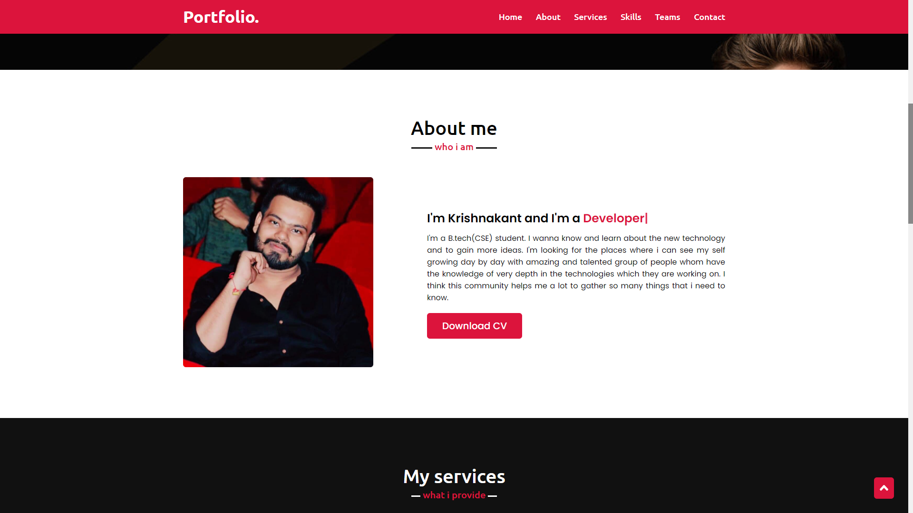
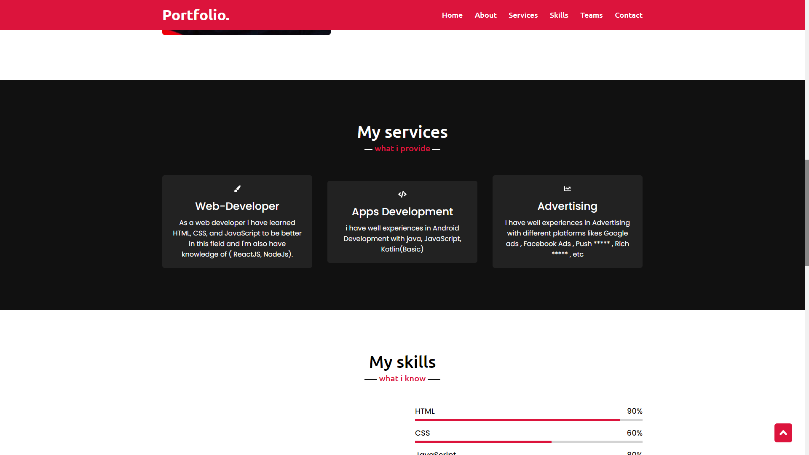
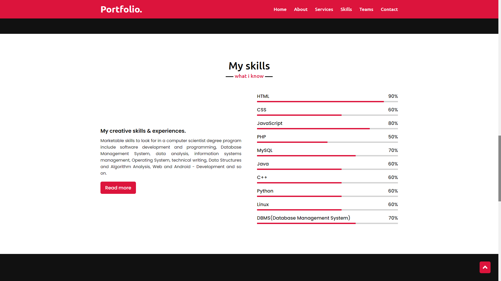
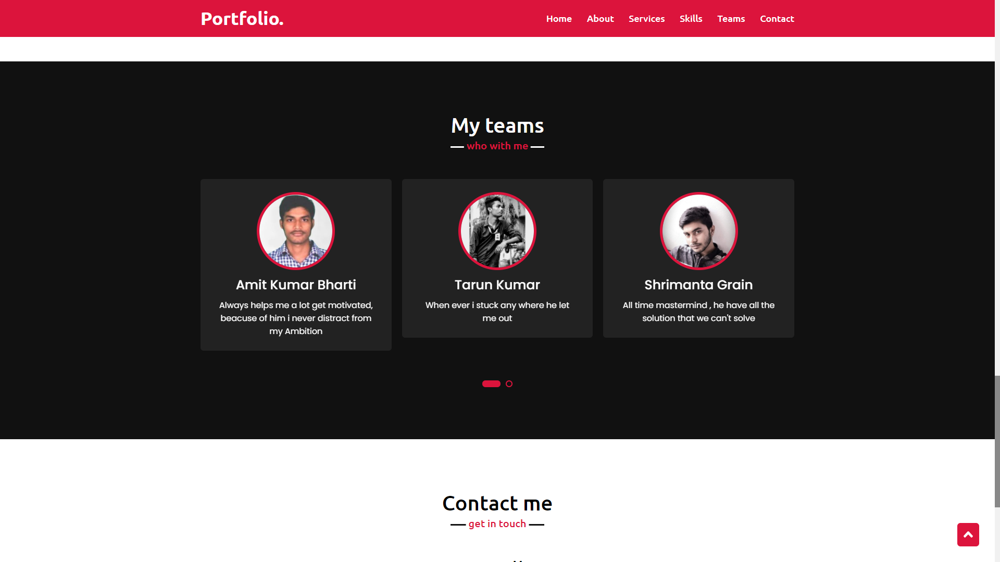
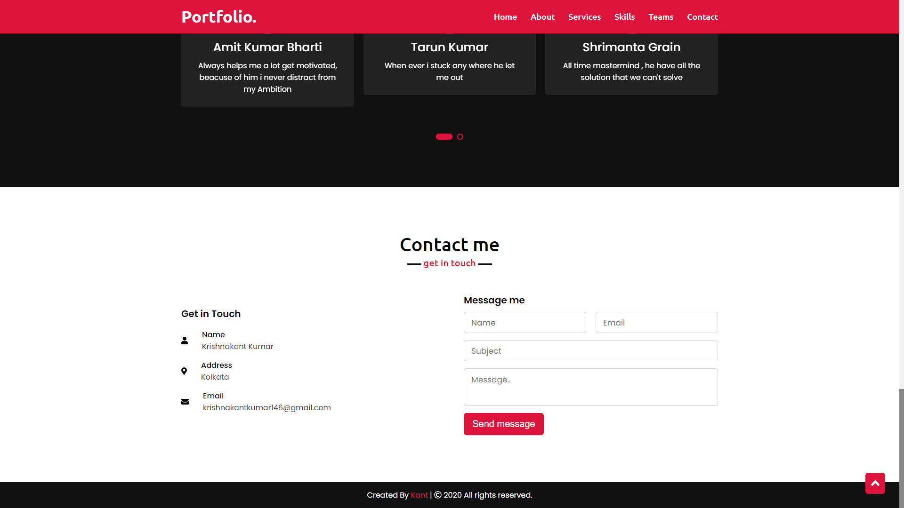

## 🚀 Project Name :<a href="https://kant146.github.io/Kant-Portfolio-Website/"> Kant Portfolio Website </a>

## 🧰 Tecnology Utilized
* VSCode ( IDE )
* HTML
* CSS
* JavaScript

## 🔗 Link of Project
[ 🌎 Portfolio](https://kant146.github.io/Kant-Portfolio-Website/) - Project online on GitHub Pages

 Source Code: https://github.com/kant146/Kant-Portfolio-Website

Instagram: https://www.instagram.com/kant_146/  
Github: https://github.com/kant146    
Facebook: https://www.facebook.com/omgkant.146/   
Website: https://kant146.wordpress.com/    

## 🖼️ Images of Project

   
    
   
     
   
    
   
    
   
     
   

